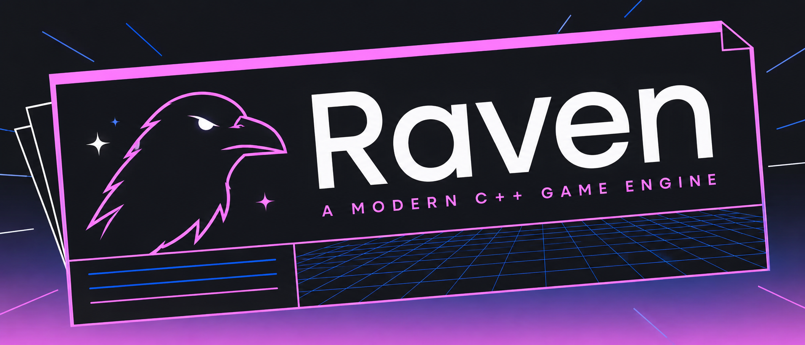

# 🐦‍⬛ Raven

Raven is a modern C++23 game engine built with a focus on performance and fidelity. It achieves this through Data Oriented Design (DOD) patterns and modern rendering APIs. This is a work in progress portfolio project, and is not intended for production use (yet).

## 🤖 Usage of AI

Raven enforces a strict no-AI-code-generation policy. AI may be used as a tool for research, planning, and answering questions, but never to generate code that ends up in the core codebase. It maybe used to generate code for unit tests or utility scripts, but only if the generated code is reviewed and approved by a human developer.

## ⬇️ Prerequisites

Software/Tools you need to install before setting up the development environment.

- [XMake >=3.0.9](https://xmake.io/guide/quick-start.html)

### Windows Specific
- [Powershell >= 7.4.17](https://learn.microsoft.com/en-us/powershell/scripting/install/install-powershell-on-windows?view=powershell-7.4)
- [Visual Studio 2026 Build Tools](https://visualstudio.microsoft.com/downloads/) or [Visual Studio 2026](https://visualstudio.microsoft.com/downloads/) with the following workloads:
  - Desktop development with C++
  - .NET desktop build tools
  - Latest Windows 11 SDK (10.0.26100.7705 or later)
  - MSVC AddressSanitizer

## 👟 Get Started

1. Clone the repository `git clone https://github.com/Drischdaan/Raven`
2. Download and install [Prerequisites](#️-prerequisites)
3. Execute setup script `.\Setup.ps1` (Windows)
4. Open the generated Project Files (`Raven.slnx` on Windows) with the IDE of your choice

## 🪹 Branch Structure

- `main` - Most stable branch with the latest stable release/features
- `develop` - Branch for active development
  - `feature/<feature-name>` - Feature branches
  - `fix/<fix-name>` - Bugfix branches